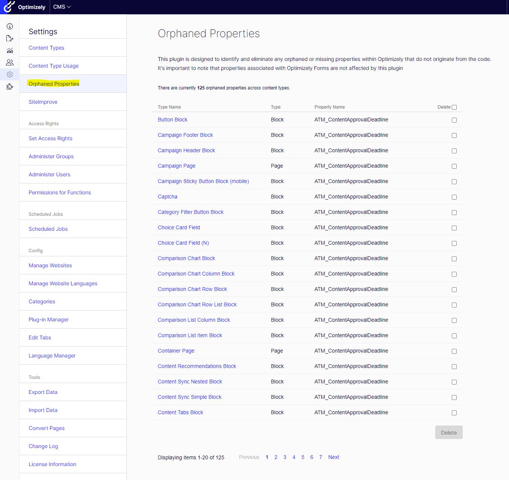

# A2Z.OrphanedProperties

## Description
[](https://docs.microsoft.com/en-us/dotnet/)
[](http://world.episerver.com/cms/)
[](http://world.episerver.com/cms/)

This Optimizely CMS plugin enables Administrators to identify and bulk delete any orphaned or missing properties (missing from code).

Modifying or deleting a property name in the content types' base class triggers an automatic removal of those properties from instances of the page, provided they hold no data. However, if these properties contain data, they are labeled as "missing," and any existing data linked to them remains until manually deleted.

These properties will be visible to editors in content types, and Administrators are required to individually visit each content type in admin mode to either remove these properties or keep them. This repetitive process is not only tedious but also prone to oversight.

Unfortunately, the admin mode currently falls short in providing a straightforward method to view all missing properties collectively and offers no simple option to delete them, which could greatly streamline management and maintenance tasks.

## Installation

The command below will install the addon in your Optimizely project.

```
dotnet add package A2Z.OrphanedProperties
```

## Usage

To access the add-on, go to Admin -> Orphaned Properties



## Contributing

Feel free to submit a pull request if you identify any areas that could be enhanced or improved.

## Feature Requests

If you have new ideas or feature requests that can make this tool even more useful for you or the community, please feel free to open a new issue at the following link.

https://github.com/adnanzameer/optimizely-orphaned-properties/issues

## Changelog

[Changelog](CHANGELOG.md)
